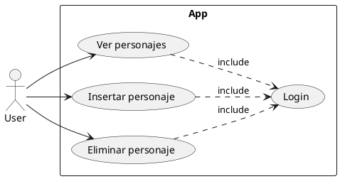
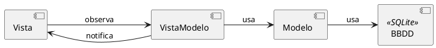

# PRACTICA MOVILES

## Analisis

|Requisitos funcionales|
|--|
|Ver la lista de personajes|
|Insertar personaje|
|Eliminar personaje|

|Requisitos no funcionales|
|--|
|Registrarse o iniciar sesión|
|Recoger la información de una base de datos|
|Interfaces con botones para la navegación entre vistas|

## DISEÑO

### Patrón de diseño arquitectónico-MVVM

Model-View-ViewModel

### Prototipo

